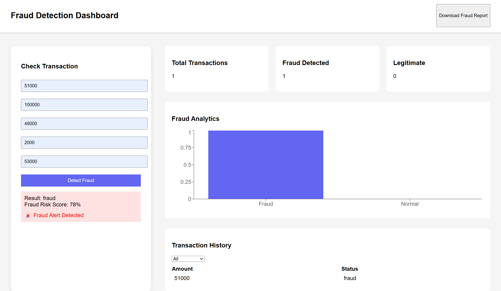

# 💳 AI Powered Fraud Detection Dashboard


---

# 📊 Overview

The **AI Powered Fraud Detection Dashboard** is a full-stack fintech analytics platform designed to detect suspicious financial transactions using **Machine Learning and Rule-Based Fraud Detection**.

Modern financial platforms process thousands of transactions every second, making fraud detection a complex problem.

This project simulates how **real banking fraud detection systems** monitor transaction behaviour using:

• Rule Based Fraud Detection
• Machine Learning Prediction
• Fraud Risk Scoring
• Fraud Analytics Dashboard
• Transaction Monitoring System

The system evaluates transaction data and generates a **Fraud Risk Score along with real-time fraud alerts and analytics**.

---

# 🎯 Project Vision

The goal of this system is to simulate how **modern fintech companies detect fraud in digital transactions**.

The platform is capable of:

• Detecting suspicious transactions
• Analysing transaction behaviour patterns
• Generating fraud risk scores
• Visualizing fraud analytics using graphs
• Displaying transaction monitoring dashboards

This demonstrates how **AI driven fraud intelligence systems improve financial security**.

---

# ⚙️ Tech Stack

### Backend

* Python
* FastAPI
* Scikit-Learn
* Pandas
* NumPy

### Frontend

* React.js
* Axios
* Recharts (Graph Visualization)

### Machine Learning

* Logistic Regression
* Behaviour Pattern Detection
* Rule Based Fraud Engine

---

# 🏗 System Architecture

The system follows a **multi-layer architecture similar to real fintech fraud detection platforms.**

```
                 ┌──────────────────────┐
                 │   React Dashboard    │
                 │ Transaction Input UI │
                 └──────────┬───────────┘
                            │ API Request
                            ▼
                 ┌──────────────────────┐
                 │     FastAPI API      │
                 │   Backend Server     │
                 └──────────┬───────────┘
                            │
               ┌────────────┴─────────────┐
               ▼                          ▼
       ┌───────────────┐         ┌─────────────────┐
       │ Rule Engine   │         │ Machine Learning │
       │ Fraud Rules   │         │ Fraud Model      │
       └───────────────┘         └─────────────────┘
               │                          │
               └──────────────┬───────────┘
                              ▼
                    ┌─────────────────┐
                    │ Fraud Decision  │
                    │ Fraud / Normal  │
                    └────────┬────────┘
                             ▼
                 ┌────────────────────────┐
                 │ Fraud Analytics        │
                 │ Dashboard & Graphs     │
                 └────────────────────────┘
```

---

# 🤖 Machine Learning Fraud Detection

The system uses a **machine learning model to analyze transaction behaviour and detect anomalies.**

### Input Features

• Transaction Amount
• Sender Balance
• Receiver Balance
• Balance Difference
• Transaction Type

### ML Workflow

```
Transaction Data
        │
        ▼
Feature Processing
        │
        ▼
Machine Learning Model
        │
        ▼
Fraud Probability Score
        │
        ▼
Fraud / Normal Classification
```

The trained ML model is stored as:

```
fraud_model.pkl
```

---

# 📈 Fraud Analytics Dashboard

The system provides **interactive fraud analytics graphs**.

### Fraud vs Normal Graph

Shows the distribution of:

```
Fraud Transactions
vs
Legitimate Transactions
```

### Dashboard Metrics

The dashboard displays:

• Total Transactions
• Fraud Detected
• Legitimate Transactions
• Fraud Risk Score

---

# 📊 Dashboard Features

### 🔎 Transaction Detection

Users can enter transaction details to check whether the transaction is **fraudulent or legitimate**.

---

### ⭐ Fraud Risk Score

Each transaction generates a **risk percentage indicating probability of fraud**.

Example:

```
Fraud Risk Score: 83%
Risk Level: High
```

---

### 🚨 Fraud Alerts

High risk transactions trigger:

```
🚨 Fraud Alert Detected
```

---

### 📈 Fraud Analytics

Interactive graphs visualize fraud activity.

Example graphs:

• Fraud vs Normal Transactions
• Transaction Analytics

---

### 📋 Transaction History

All analyzed transactions are stored and displayed in a **transaction monitoring table**.

---

### 📄 Export Fraud Report

Users can export transaction analysis as a **CSV report**.

---
## 📸 Dashboard Preview


# 📂 Project Structure


---

# ▶️ Running the Project

### Install Dependencies

```
npm install
```

### Run Full Application

```
npm start
```

Application will start:

```
Frontend → http://localhost:3000
Backend → http://localhost:8000
```

---

# 🌍 Real World Applications

Fraud detection systems like this are widely used in:

• Banking transaction monitoring
• Fintech payment platforms
• Digital wallet security systems
• Financial risk intelligence platforms

---

# 🔮 Future Improvements

Possible improvements include:

• Graph Neural Network based fraud detection
• Real time fraud monitoring
• PostgreSQL transaction database
• Advanced anomaly detection models
• Cloud deployment (AWS / GCP)

---

# 👩‍💻 Author

**Syyeda Aamna**

B.Tech Computer Science
GEN AI Engineer | AI Projects

---

⭐ If you found this project useful, consider giving the repository a **star on GitHub**.
